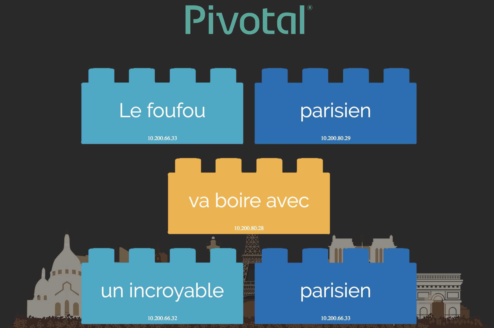

# Kubernetes Wordsmith Demo (Pivotal FR Edition)

Wordsmith is the demo project shown at DockerCon EU 2017, where Docker announced that support for Kubernetes was coming to the Docker platform.

The demo app runs across three containers:

- [db](db/Dockerfile) - a Postgres database which stores words

- [words](words/Dockerfile) - a Java REST API which serves words read from the database

- [web](web/Dockerfile) - a Go web application which calls the API and builds words into sentences:



## Original Edition

If you want to deploy the original edition, replace in kube-deployment.yml:

```
image: docker.io/ecointet/k8s-wordsmith-db-pivotal
image: docker.io/ecointet/k8s-wordsmith-web-pivotal
```
with

```
image: dockersample/k8s-wordsmith-db
image: dockersample/k8s-wordsmith-web
```

> Or you can use the original manifest
> `https://github.com/dockersamples/k8s-wordsmith-demo/blob/master/kube-deployment.yml`


## Deploy Using a Kubernetes Manifest

Clone this repo :

```
git clone https://github.com/ecointet/k8s-wordsmith-demo
cd k8s-wordsmith-demo/
```

Apply the manifest using `kubectl`:

```
kubectl apply -f kube-deployment.yml
```

Check the external IP:

```
kubectl get services
```

Now browse to `http://IP-LOAD-BALANCER:8081`.

## The full story with Pivotal PKS
Before the previous commands, please login to PKS `kubectl`:

```
pks login -a <PKS API> -u <PKS USER> -p <PKS PASSWORD> -k
```
```
pks get-credentials <CLUSTER NAME>
```
```
kubectl cluster-info
```

##  Edit your own Words

If you want to set new words, you can edit `db/words.sql`:

```
cd db
docker build -t <YOUR-REPO>/<NEW-DOCKER-IMAGE> .
docker push <YOUR-REPO>/<NEW-DOCKER-IMAGE>
```
Then edit the file `kube-deployment.yml` to replace it with your container name.

